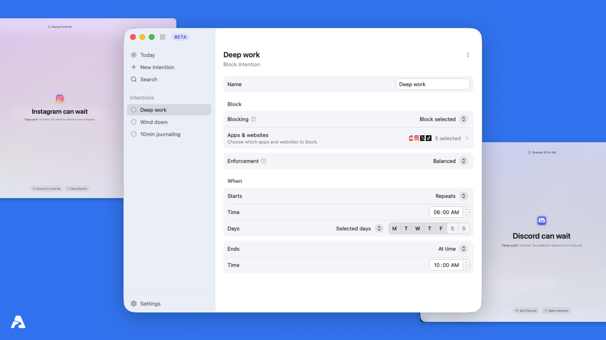

  

<h3 align="center">Abstand <i>by <a href="https://builder.group/">builder.group</a></i></h3>

  Intentional distance for focused work.
   
  A macOS app for holding the boundaries around your attention.
   
  <a href="https://abstand.app/"><strong>Download for macOS »</strong></a>

  
  
  
  

 

  

## Introduction

Abstand is an open-source macOS app and website blocker for creating intentional distance from digital distractions.

Your attention is like a river. Concentrated, it moves with power. Branched across tabs, apps, and notifications, it spreads thin. You feel busy. Nothing moves.

**Abstand** is a macOS app that builds the banks. You define your boundaries in advance, when you are clear-headed. The app holds them when it matters, so you do not have to make the hard decision again in the moment of temptation.

The word is German for distance. That is exactly what it creates.

## Download

- **macOS:** [Download Abstand](https://abstand.app/) · [Latest GitHub release](https://github.com/builder-group/abstand/releases/latest)
- **Windows:** planned
- **Linux:** planned

## Features

- Schedule focused blocking sessions in advance
- Block distracting apps and websites on macOS
- Use Strict Enforcement when a commitment needs to hold
- Start and monitor active Abstands from the menu bar
- Keep your data local on your device
- Open source under AGPL v3

## How it works

**Intentions** are configured commitments. You set when they start, when they end, and what kind of distance they enforce. When an Intention fires, you take an **Abstand**: the active experience of intentional distance.

- **Block** builds a hard wall. Configured apps and websites are inaccessible for the full duration. For a complete lockdown, the entire computer can be blocked behind a full-screen overlay.
- **Break** (coming soon): a rhythm of screen breaks at regular intervals, pulling your attention away from the screen before resuming.

### Examples

- **Deep work:** block distracting apps and websites every weekday from 6:00 AM to 10:00 AM
- **Writing or study:** allow only your editor, notes, or research tools for a focused sprint
- **Evening wind-down:** block the whole device from 8:00 PM so the workday actually ends
- **Digital detox:** block social media apps and websites every day for 30 days
- **Journaling:** allow only Notion for a 10-minute manual session

## Tech Stack

- **Frontend:** React, TypeScript, TanStack Router, Vite, Tailwind CSS
- **Desktop Runtime:** Tauri
- **Native/Core:** Rust, Swift
- **Storage:** SQLite, local JSON settings
- **Tools:** pnpm, Turborepo, ESLint, Prettier, Vitest

## License

Abstand is open source under the **GNU Affero General Public License v3.0 (AGPL v3)**.

See [LICENSE](./LICENSE) for the full license text and [docs/decisions/license.md](./docs/decisions/license.md) for the reasoning behind this choice.
